# Content Manager

## Introduction

Content Manager GUI helps in managing packages. It displays locally downloaded packages and remote packages available for download in a easy to use graphical interface.
User can checkout remote packages or update locally downloaded packages once remote version is updated. It helps in managing package dependencies.

## Launch Content Manager

## Method 1 : Plugin Installation

The MHC is available as a plugin extension to the MPLAB® X IDE and as a standalone Java application for use with other tool suites (see here for details). Regardless which form you choose, there are some prerequisites that you must have installed first. Additionally, you will need to have a supported 32-bit MCU board on which to program, run, and debug your application.

### Prerequisites for MHC use as an MPLAB® X IDE Plugin

* Install the MPLAB® X IDE, available from www.microchip.com/mplab.
* Install the XC32 C/C++ compiler for support of all Microchip 32-bit MCUs, available from www.microchip.com/xc32.

Installing MPLAB® Harmony Configurator from the Microchip Plugins Update Center
The MHC is not automatically installed with MPLAB® X IDE. You will need to take additional steps to download and install it through Microchip Plugins Update Center:

### Steps

1. Open the MPLAB® X IDE.
2. In the top-level menu, select to Tools > Plugins.
3. In the Plugins window, select the Available Plugins tab.
4. Select MPLAB® Harmony Configurator 3 from the list of available plugins and click the Install button. The Plugin Installer opens.
5. Click Next and review the License Agreement.
6. Click Install when you are ready for the Plugin Installer to begin downloading the MHC plugin. When the MHC plugin download is complete, MPLAB® X IDE will ask to be restarted.
7. Select Restart Now and click Finish. Upon restart, the plugin is installed. You can now open MHC on a new or already existing MPLAB® X IDE project.
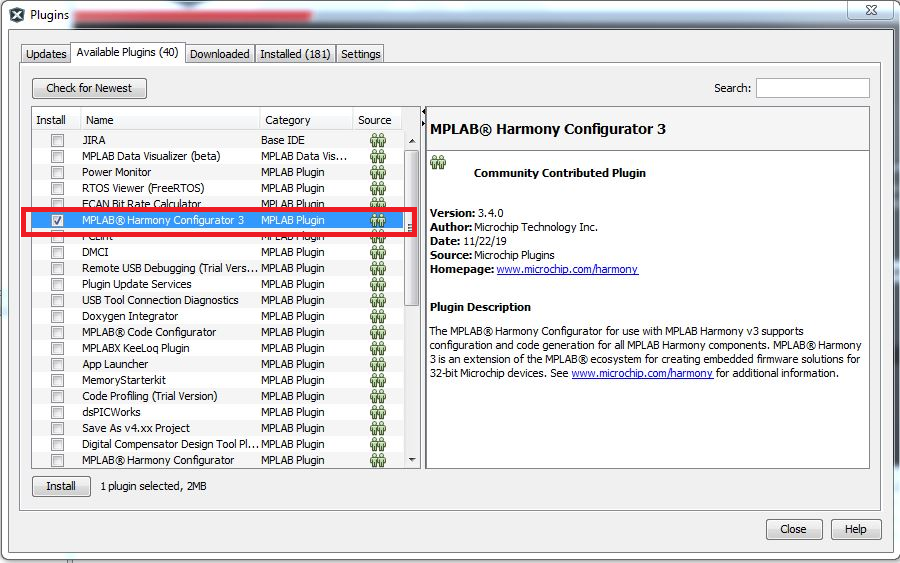

    Figure 1-1. Framework Installation Path

### From the Tools > Embedded > mplab® Harmony 3 Content Manager menu option.

Figure 1-2. Launch Content Manager

## Downloading Harmony Packages

After launching the MPLAB® Harmony Content Manager, you will need identify the local folder to which you wish to download the MPLAB® Harmony packages and you will need to direct the downloader to the repository server.

*Server1:*  <https://github.com/Microchip-MPLAB-Harmony/>

*Server2:* <https://gitee.com/Microchip-MPLAB-Harmony/>

* In the Content Manager input Path dialog, select the desired framework installation folder (create a new folder if required, by using __browse__ button).
  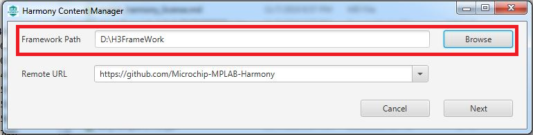

  Figure 1-3. Framework Installation Path
* Provide the repository URL and test the connection. You can change the default     selected remote url by expanding combo box.
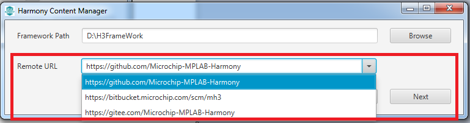

  Figure 1-4. Repoisitory URL
* Test connection by clicking the __Next__ button.

    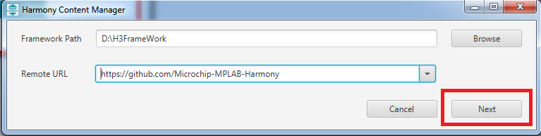

  Figure 1-5. Click Next
* Test Conection Status

    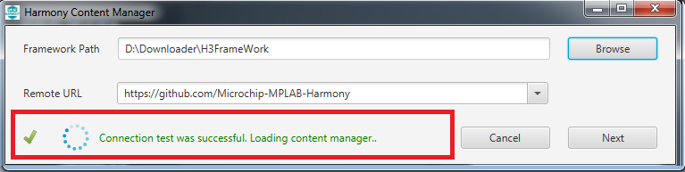

    Figure 1-6. Connection Status
* After checking test connection, it will clone the latest content manager downloader tool to selected local harmony path and will launch automatically.
  * Initial Loading Screen
    1. Content Manager Latest Version.
       * Latest Version will be updated dynamically
    2. Downloading Catalog information
       * It will fetch both local(if already local packages available) and remote packages catalog information.
    3. Selected Local Harmony Path
    4. Show Log
    5. Remote Connection Status
    6. Settings Option
        * Don't change any settings while some operations are in progress.
    7. Latest News about Harmony Packages

    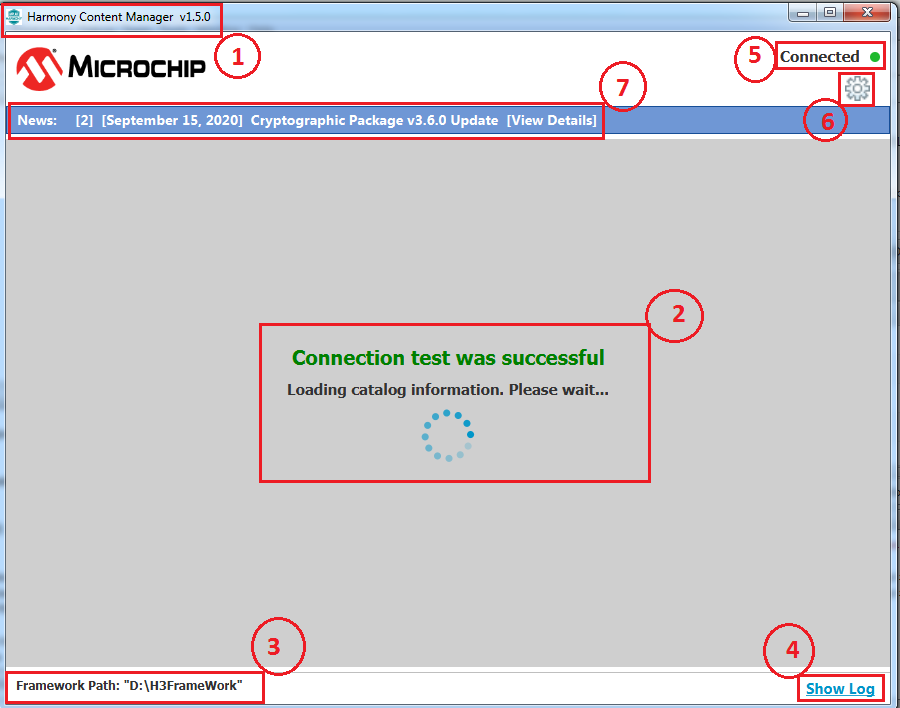

    Figure 1-7. Content Manager Catalog Downloading
  * Show Log Screen

    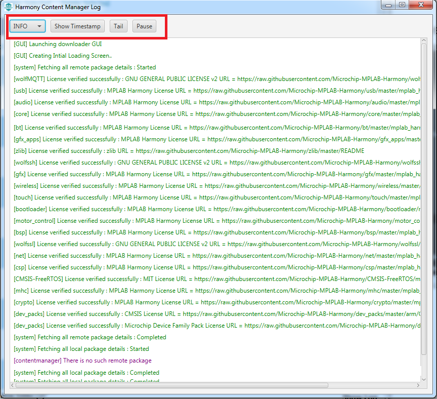

    Figure 1-8. Show Log Screen
* Content Manager GUI
  * Downloader Screen
    1. All remote packages will be listed under remote packages section. Packages which are already cloned will not be listed here.
    2. Package detailed web information can be viewed by clicking info icon.
    3. Each remote package dependencies will be shown (if available).
    4. All license can be viewed and accepted at once by clicking __View & Accept Licenses__ hyperlink.
    5. All packages can selected/unchecked by using __Select All__ checkbox.
    6. Multiple packages can be downloaded by clicking __Download Selected__ link.
    7. Single package Download
        * Dependencies packages also will be marked to download based on user choice.
    8. Package Title : This title helps to identify the group of packages which contains both parent package and its related application packages together.
    9. Treeview support to added to fold/unfold the group of packages.

    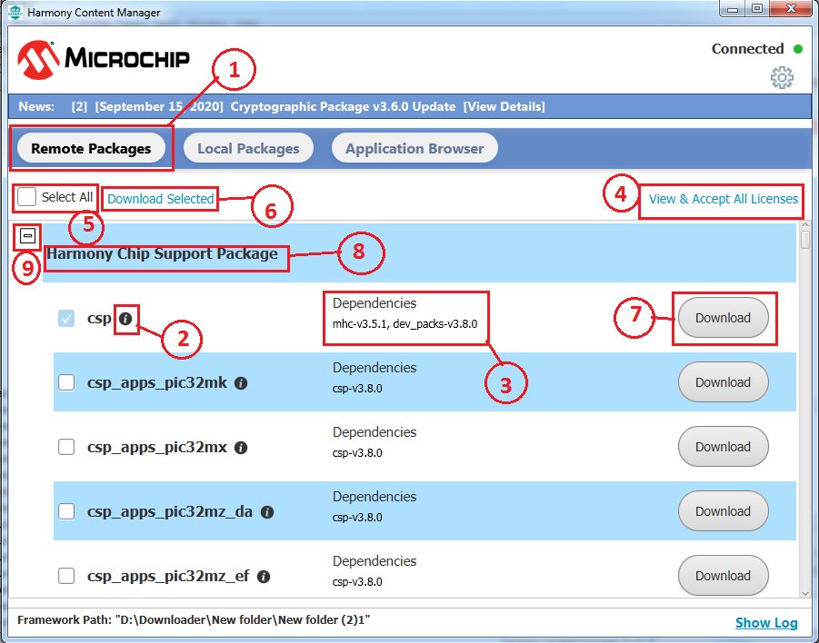

    Figure 1-9. Content Manager GUI
  * License Dialog
    1. All license names will be listed here.
    2. List of packages will be updated based on selected license name
    3. License information
    4. Accept selected license
    5. Navigate to next license by clicking on __Next__ button.
    6. Navigate to previous license by clicking on __Previous__ button.
    7. Accept all licenses at one click
    8. Close License Window

        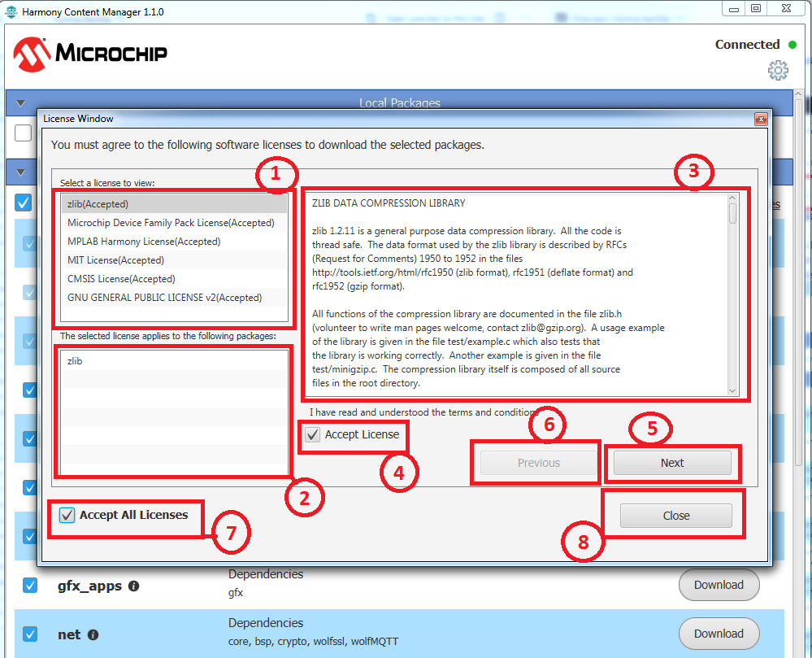

        Figure 1-10. License Dialog
  * Downloading Remote Packages
    1. Individual remote package download progress status
    2. Global download status of current downloading packages.
    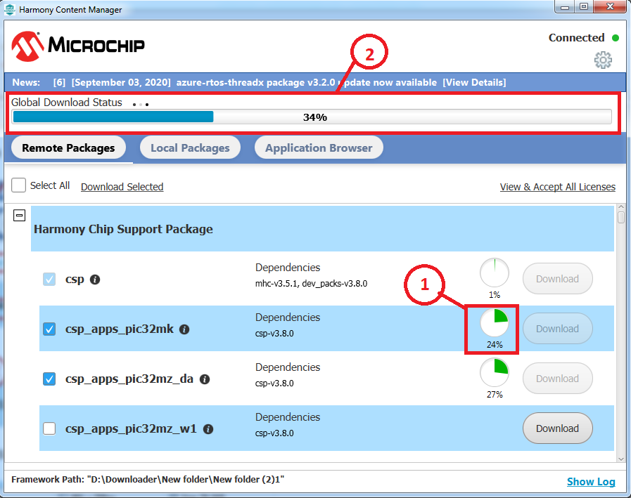

        Figure 1-11. Downloading Packages
  * Local Packages
    1. Local Package tab
    2. This local package is synchronized with remote version. (No update required)
    3. Local package need to be updated. (Higher version available in remote)
    4. Package is not cleaned and update also required. Can be cleaned through local package settings option.
    5. Local Package Settings Option (Explained below)
    6. Checkout to different versions.
    7. Package is synchronized but not cleaned.
    8. Dependencies Checkout (Explained below).
    9. Web link
    10. Application Browser (Explained below)
    11. Select All Packages
    12. Clean Selected Packages
    13. Update Selected
    14. Delete Selected
    15. Load Manifest (Explained below)

        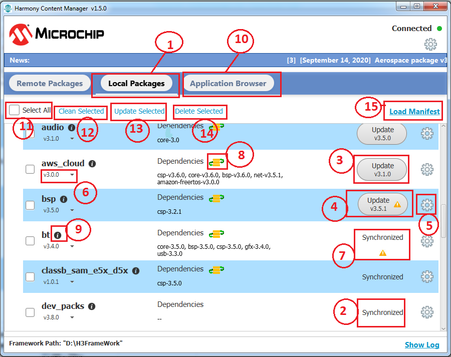

        Figure 1-12.1. Local Packages
    16. Load Manifest
        * Click on "Load Manifest" link to checkout all project dependency packages.
        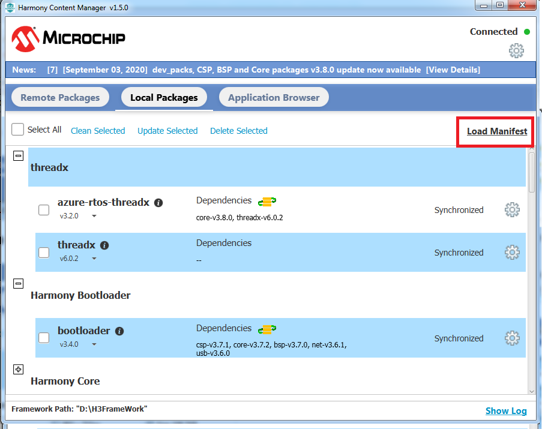

            Figure 1-12.2. Load Manifest
        * After clicking on load manifest, we need to select  harmony project directory to load manifest file automatically (harmony-manifest-success.yml).
        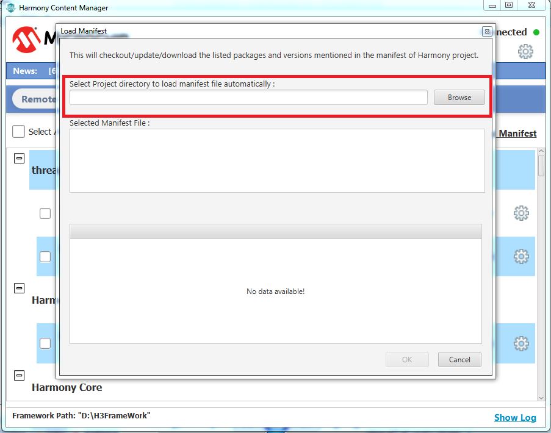

            Figure 1-12.3. Load Manifest
        * Table Columns (If tick mark selected):
          * Download: If target dependency package is not available locally, then it need to be downloaded from remote.
          * Clean : Target dependency package is not cleaned.
          * Update : Target dependency package  need to be updated.
          * Checkout : Target dependency package  need to be checked out.
        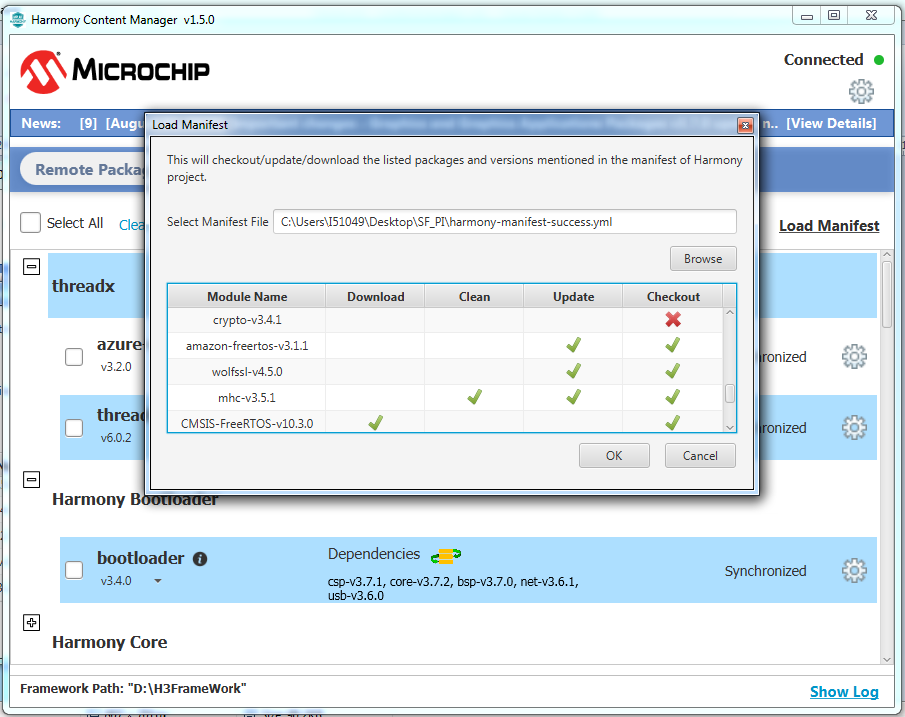

            Figure 1-12.4. Load Manifest
        * This action will result of auto download/clean/update/checkout of project dependency packages. So, please beaware of your local changes before clicking "ok" button.
    17. Dependencies Checkout
        * Click on dependency icon to checkout the package dependencies.
       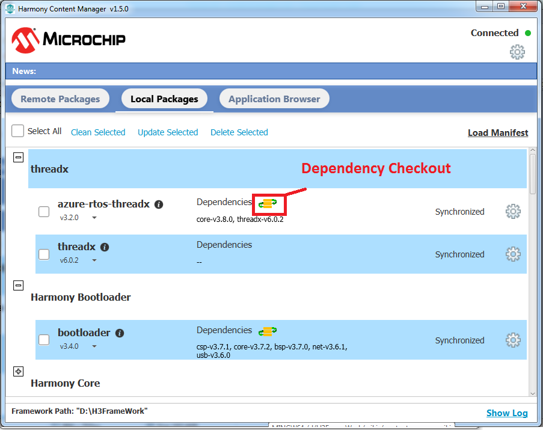

            Figure 1-12.6. Dependency Checkout
        * This icon will not be visible, if all dependencies are already checked out to target versions.
        * After clicking on dependency icon, all required operations like download/clean/update/checkout data will be shown in a table.
        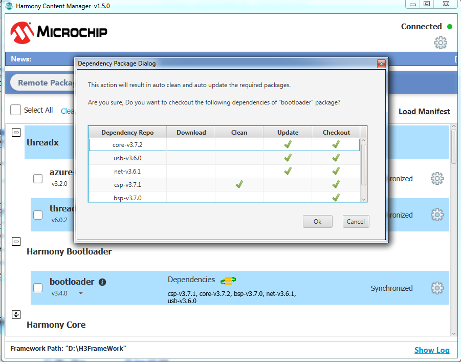

            Figure 1-12.6. Dependency Checkout
        * This action will result of auto download/clean/update/checkout of dependency packages. So, please beaware of your local changes before click "ok" button.
    18. Local Package Settings
        * Clean Package
        * Delete Package
        * Open Local Package Directory
       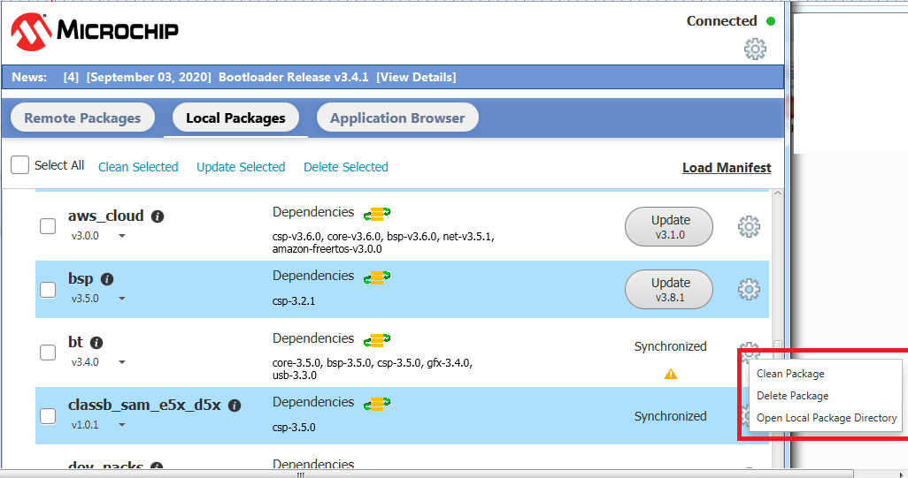

            Figure 1-12.7. Local Package Settings
  * Application Browser
    1. Application Browser Tab
    2. Demo Application
    3. Description of applicaion
    4. Individual project web help (Offline)
    5. Select Project to copy
    6. Enter keyword to search desired applications.
    7. Current listed projects count.
    8. Change category type to view respective type of applications.
    9. Select all
    10. Copy selected projects to specified user directory.
    11. Refresh browser to browse latest downloaded projects.

        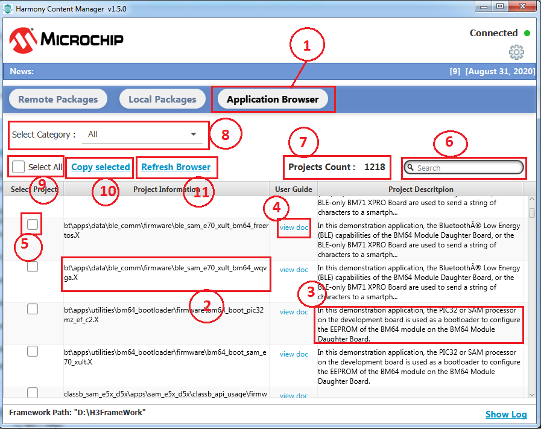

        Figure 1-14. Application Browser

## Method 2 : Launch Content Manager in Stand Alone Mode

* Go to Content Manager directory from local harmony path.
  * Cloned latest __Content Manager__ directory.

    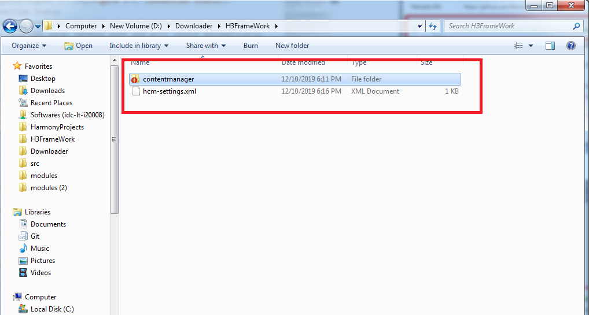

        Figure 2-1. Content Manager Directory
  * __Content Manager__ can be launched __Stand Alone__ by double clicking the jar.
  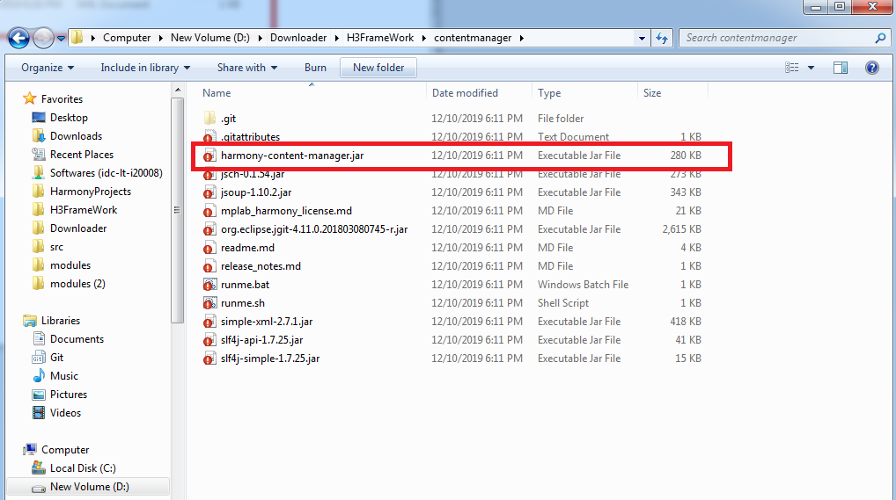

        Figure 2-2. Content Manager Jar

## Note 2-> Regarding __Content Manager future updates__

* Case 1: If user selects new local harmony path->
  * Then always latest content manager will be cloned to selected harmony path and will be launched.
* Case 2: If user selects exising local harmony path->
  * If user is having internet connection, then existing content manager will be deleted locally and latest content manager will be updated. (Older content manager will be replaced by latest one)
  * If user doesn't have internet connection, then locally existing content manager will be launched.

## Network Ports Usage

This section describes which network ports are used in Content Manager. This may help users on configuring their proxy/firewall/antivirus properly.

Content Manager is independant from MPLAB X. It is using system settings regarding proxy. If user machine doesn't allow the Content Manager to create connections on 443, then it can *not* download any repositories. So, you must not deny the Content Manager to create https connection with Github in port 443.

The Windows only git service (based on libgit2) is using random port on localhost. So, please make sure that it is not blocked by security tools.

| Port    | Service     | Description |
|-----    |--------     |-------------|
| 443     | HTTPS       | Access to the web application and Git over HTTPS. |
| 80      | HTTP        | Access to the web application. All requests are redirected to the HTTPS port when SSL is enabled. |
| random  | proprietary | Windows only. Localhost connection on git service (faster cloning) |
